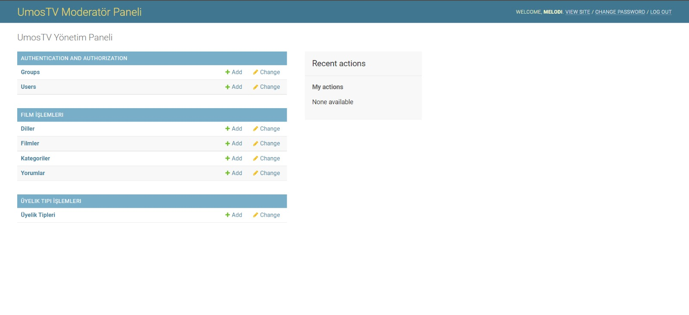
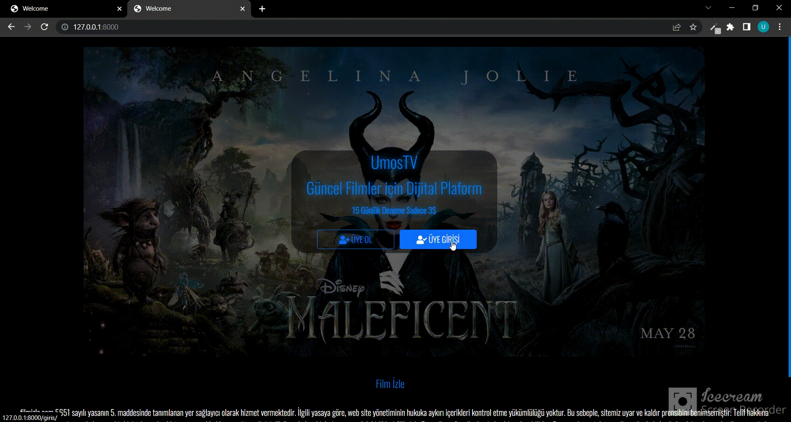

### Hakkında
Bu **Film Sitesi** projesi **NEOS Yazılımın** yazılım bootcamp'i sonrası aynı sınıfta olan üç kişinin yapmış olduğu bitirme projesidir. Projenin Front-end bölümünde Melodi Bayraktar ve Selenga Yavuz , Back-end ve Responsive bölümünde ise Umut Gedik görev almıştır.
 
 ### 1)Admin/Moderatör Rolü

    

#### i)Admin Rolü 
* :pencil: Django Superuser'ı olan adminler ise her bilgi üzerinde **CRUD** yetkilendirmesine sahiptir

#### ii)Moderatör Rolü

* :pencil: Moderatörler kullanıcıları , yorumları ve üyelik tiplerini görüntüleyebilir ; dilleri , filmleri ve kategorileri görüntüler , ekler , çıkarır ve günceller .

                                                                        
### 2)Kullanıcı Rolü
* :lock: Bu rolde 2 farklı abonelik paketi bulunmaktadır. Üye olurken tercihinizi **15 günlük deneme sürümünden** ya da **1 aylık tam abonelikten** yana kullanabilirsiniz.

##### Üye Olma Ekranı

    

##### Üye Girişi Ekranı

    

##### Genel Kullanım

    

* :clapper: Film izleyebilmek için öncelikle siteye üye olmalısınız; eğer üyeyseniz siteye giriş yapmalısınız. 

<!-- Üye ol ve Giriş yap gifleri -->

* :key:Giriş yaptığınızda karşınıza çıkacak ekran aşağıdaki gifteki gibi olacaktır.

    

* :pencil: Dilediğiniz filme yorum yapabilir, yaptığınız tüm yorumları üyelik sayfanızdan görüntüleyebilirsiniz.

### :bulb: Kullanılan Teknolojiler

* Bu projede kullanılan programlama dili **Python 3.7.8 sürümündedir**. 
* Bu projede kullanılan **Django framework versiyonu ise 3.2.12'dir**.

###  :email: İletişim
#### Umut Gedik
* Github : [xyzumut](https://github.com/xyzumut)
* LinkedIn: [Umut Gedik ](https://www.linkedin.com/in/umut-gedik/)
* E-Mail Adresi: [xyzumut06@gmail.com](xyzumut06@gmail.com)
#### Melodi Bayraktar
* Github : [MelodiBayraktar](https://github.com/MelodiBayraktar)
* LinkedIn: [Melodi Bayraktar ](https://www.linkedin.com/in/melodibayraktar/)
* E-Mail Adresi: [melodi_bayraktar@hotmail.com](melodi_bayraktar@hotmail.com)
#### Selenga Yavuz
* Github : [selenYvz](https://github.com/selenYvz)
* LinkedIn: [Selenga Yavuz ](https://www.linkedin.com/in/selenga-sarpkaya-218aab239/)
* E-Mail Adresi: [selengasarpkaya80@gmail.com](selengasarpkaya80@gmail.com)

